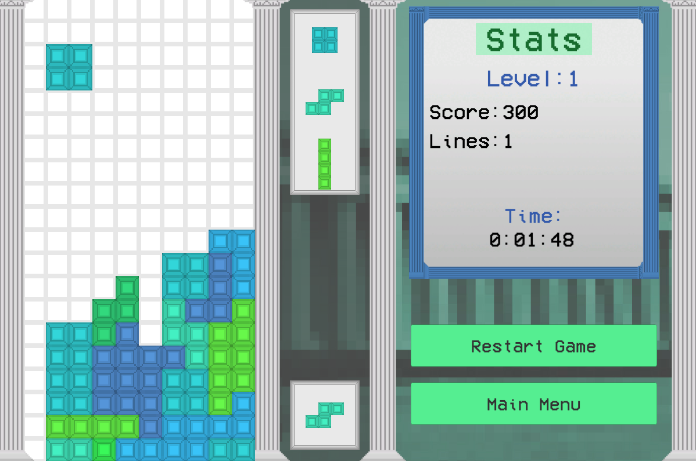
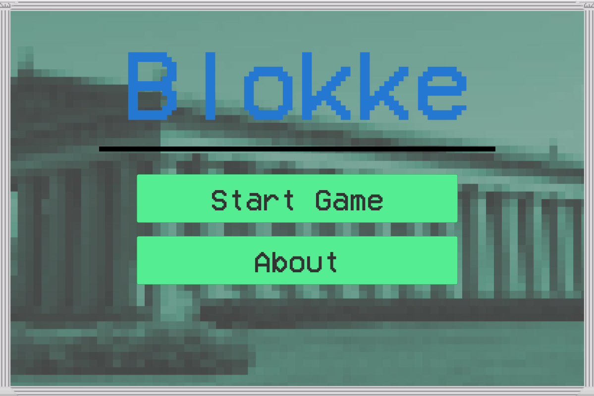
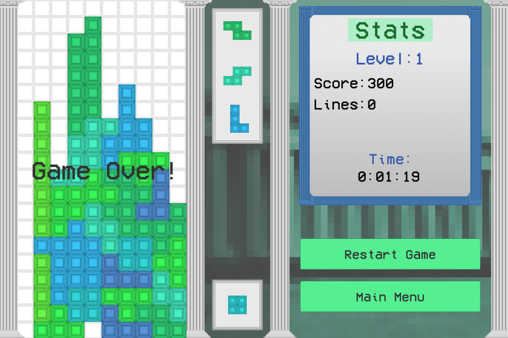

# Blokke


Blokke is a open source Tetris clone with a green & blue aesthetic. It includes most core features and mechanics of Tetris, such as a holding function and scoring system. I built Blokke as a way to get familiar with Unity.

## Running
Clone repo:
```
~$ git clone https://github.com/Visual-mov/blokke
```

Navigate to `blokke/Builds`, and select the file for your platform. Currently only Windows is supported.

## Controls
The controls for Blokke are also included in the "About" menu. Blokke supports keyboard or control pad for input.
```
Move block left        | A or left on d-pad
Move block right       | D or right on d-pad
Move block down        | S or down on d-pad
Move block down faster | W or up on d-pad (hold)
Rotate block           | Space or button 3
Hold block             | Q or button 2
```

## Screenshots


